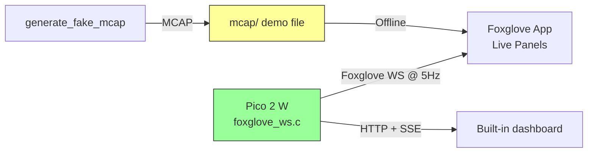

# Foxglove Integration for Monster Book of Monsters

Foxglove support for the Pico 2 W battlebot — live telemetry, 3D orientation,
and bench-testing controls.

**The bot connects to Foxglove directly.** The firmware serves the Foxglove
WebSocket protocol itself. There is no host-side bridge to start.

## What's Here

- **`../src/networking/foxglove_ws.c`** — the Foxglove server in the firmware
- **`layouts/`** — Foxglove layouts ready to import
- **`tools/`** — the MCAP demo generator (C++ / CMake), for work without hardware
- **`mcap/`** — landing zone for MCAP recordings (gitignored contents)
- **`repo-review.md`** — technical review of the battlebot firmware

## Quick Start

1. Power the bot and wait for it to join Wi-Fi. The serial console prints the
   address:

   ```
   Foxglove ready. In Foxglove, open a connection to ws://192.168.1.42:8765
   ```

2. Put your laptop on the same network as the bot.
3. Open [Foxglove](https://app.foxglove.dev). Choose **Open connection**, then
   **Foxglove WebSocket**, and enter `ws://<bot-ip>:8765`.
4. Import `layouts/battlebot-dashboard.json`.

Without the hardware, generate a simulated match and open the file instead:

```bash
cd tools
cmake -S . -B build && cmake --build build
./build/generate_fake_mcap    # writes ../mcap/fake-match.mcap
```

See `tools/README.md` for full options.

## Architecture



The bot runs two servers at the same time:

| Port | Server | Purpose |
|---|---|---|
| 80 | HTTP + SSE | The built-in web dashboard |
| 8765 | Foxglove WebSocket | Foxglove app connections |

## Why the Firmware Speaks the Protocol

The Foxglove C++ SDK cannot run on the Pico 2 W. Its core is a prebuilt Rust
library that needs a full operating system. So `foxglove_ws.c` implements the
wire protocol (subprotocol `foxglove.sdk.v1`) on top of lwIP raw TCP.

Messages use the `json` encoding with `jsonschema` schemas. That removes the
need for a protobuf runtime on the microcontroller. Foxglove treats a
JSON-encoded `foxglove.FrameTransform` the same as a protobuf one, so the 3D
panel works.

## Schemas

| Topic | Schema | Rate | Notes |
|---|---|---|---|
| `/tf` | `foxglove.FrameTransform` | 5 Hz | **Standard.** Drives the 3D panel. Quaternion computed from IMU roll/pitch/yaw. |
| `/motors` | `battlebot.Motors` | 5 Hz | `{left, right, weapon}` — no standard schema for motor commands. |
| `/imu` | `battlebot.Imu` | 5 Hz | Composite matching `sensor_msgs/Imu`: orientation, angular_velocity (rad/s), linear_acceleration (m/s²). |
| `/state` | `battlebot.State` | 1 Hz | `{controller, failsafe, command_age_ms}` — drives the Indicator panels. |
| `/thermal` | `battlebot.Thermal` | 1/3 Hz | `{temperature_c, humidity}`. The DHT11 is slow, so this rate is low. |

`battlebot.Battery` and `battlebot.Event` exist in the demo generator only. The
bot has no battery sensor wired, and event markers are still on the roadmap.

**Plotting Euler angles**: the layout uses Foxglove's built-in `.@rpy` function
to read roll/pitch/yaw back out of the quaternion — for example
`/imu.orientation.@rpy.yaw.@degrees`.

## Timestamps

The Pico has no real-time clock. Message log times are **nanoseconds since bot
boot**, not Unix time. The timeline in Foxglove therefore starts near zero.
Durations and relative times are correct.

## Limits

- **Two clients at a time.** Each client needs a receive buffer. A third
  connection gets `503 Service Unavailable`. Change
  `FOXGLOVE_WS_MAX_CLIENTS` in `src/config/config.h` if you need more.
- **No MCAP recording on the bot yet.** The SD card driver (`sd_storage.c`) is
  implemented but not wired into telemetry. See the roadmap.
- **Client frames must fit in 1 KB.** A larger frame drops the connection.
  Bench commands are far smaller than that.

## Demo Data

A reference recording is committed at **`mcap/fake-match.mcap`**. Open it in
Foxglove with `layouts/battlebot-dashboard.json` to see every panel populated,
including battery and match events, which the live bot does not publish.

`tools/src/generate_fake_mcap.cpp` simulates a 2-minute match with realistic
phase progression: init → weapon spinup → engagement → **big hit** → recovery →
aggressive combat → **second hit** → final push → end.

```bash
cd tools
./build/generate_fake_mcap                 # fresh run with random data
./build/generate_fake_mcap --seed 42       # repeatable (the committed file uses this seed)
```

## Bench Commands

The layout has Publish panel buttons. The bot handles them in
`foxglove_ws.c`, with no HTTP hop:

| Topic | Payload | Action |
|---|---|---|
| `/cmd/estop` | `{}` | Toggle the active/stopped state |
| `/cmd/test` | `{"motor":"weapon","power":35,"duration":5}` | Run a one-shot motor test |
| `/cmd/test_stop` | `{}` | Stop the motor test |

`duration` is in seconds. Omit it, or send `0`, to hold until you stop the test.
`motor` is `left`, `right`, or `weapon`.

The layout ships with buttons for all three topics: `/cmd/estop`,
`/cmd/test`, and `/cmd/test_stop`. Open the advanced view on the "START MOTOR
TEST" button to edit the motor, power, and duration before you publish.

## Roadmap

### Done
- **On-device Foxglove server** — the bot serves `ws://<bot-ip>:8765` itself
- **Standard FrameTransform for 3D** — live 3D view of bot orientation
- **Accel and gyro on the live stream** — the Foxglove path publishes the full
  IMU record, which the CSV over SSE cannot carry
- **Foxglove layout** — motor plots, IMU (with `.@rpy` Euler extraction),
  thermal, state indicators, Publish buttons
- **Bench commands** — `/cmd/estop`, `/cmd/test`, `/cmd/test_stop` handled on
  the bot

### Next
- **Battery voltage** — `PIN_BATTERY_ADC` is assigned but no sensor is wired.
  Once it is, add a `/battery` channel.
- **MCAP-to-SD firmware work** — hook `sd_storage.c` into the telemetry
  pipeline so the bot records its own MCAP files. The driver is implemented but
  `sd_card_init()` is never called.
- **Event markers** — publish `battlebot.Event` on `/events/match` for key match
  moments. `tools/src/generate_fake_mcap.cpp` shows the pattern.

## Safety

**The Publish panel buttons are for BENCH TESTING ONLY.** Do not use them as a
real e-stop. Always wear safety goggles and keep a physical e-stop ready when
you work with high-amp systems.

The direct connection removes the bridge hop, but Wi-Fi is still not
safety-critical. Packets can be lost or delayed.

## Key Links

- [Foxglove WebSocket protocol](https://github.com/foxglove/ws-protocol)
- [Foxglove docs](https://docs.foxglove.dev)
- [MCAP spec](https://mcap.dev)
